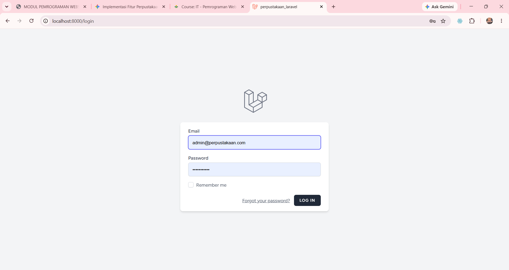
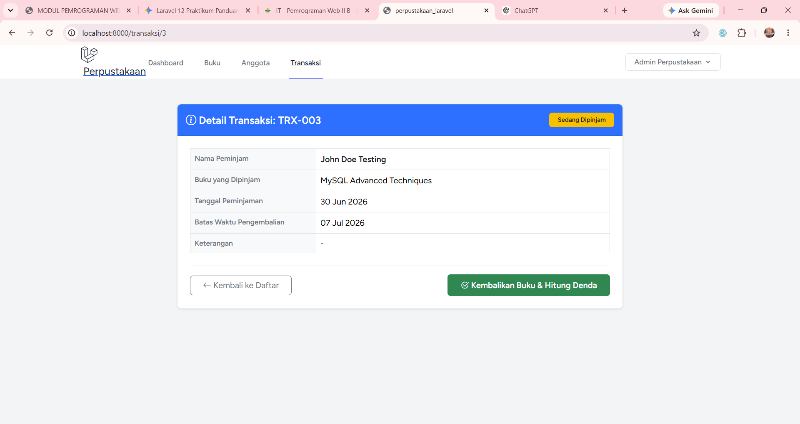
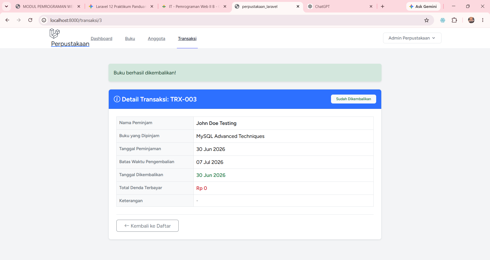
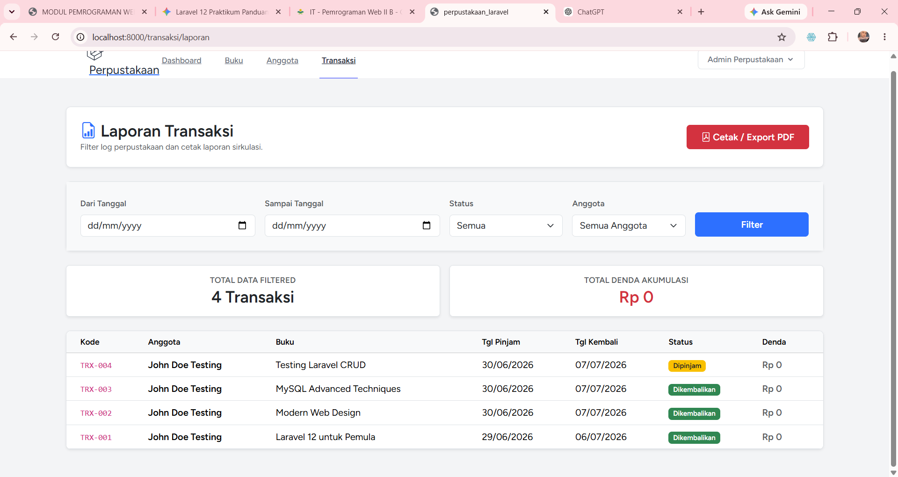
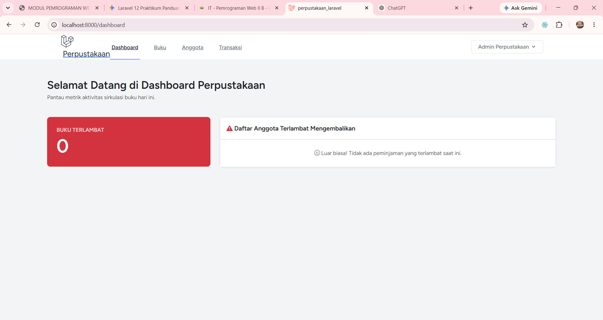

# Sistem Manajemen Perpustakaan - Modul Authentication & Transaksi Pemminjaman
 **Nama:** Eka Visi Kurnia
 
 **NIM:** 60324074

Proyek ini merupakan kelanjutan dari sistem manajemen perpustakaan berbasis web menggunakan **Laravel 12** dan **PHP 8.2**. Dokumentasi ini berfokus pada pengerjaan **Praktikum Pertemuan 14**, yang mencakup implementasi **Authentication (Keamanan Multi-User)**, **Sirkulasi Transaksi Peminjaman Buku (CRUD & DB Transaction)**, serta pemenuhan tugas tingkat lanjut meliputi kalkulasi denda otomatis, fitur filter & laporan cetak bersih, dan widget notifikasi keterlambatan.

---

## Fitur Utama

### 1. Sistem Autentikasi Keamanan (Praktikum 1 - 3)
* **Laravel Breeze Installation**: Sistem login dan registrasi bawaan menggunakan scaffolding Blade + Alpine.js untuk mengamankan kredensial admin perpustakaan.
* **Custom Navigation & Dashboard**: Penyesuaian UI menu navigasi untuk modul Buku, Anggota, Transaksi, serta kartu statistik data sirkulasi real-time di halaman utama dashboard.
* **Route Protection via Middleware**: Pembatasan hak akses penuh di mana seluruh URL sirkulasi dilindungi dengan middleware `auth` untuk mencegah akses ilegal tanpa login.

### 2. Manajemen Transaksi Peminjaman (Praktikum 4 & 5)
* **Create Peminjaman**: Pemrosesan transaksi baru dengan pemilihan Anggota, Buku, dan Tanggal Pinjam secara aman memanfaatkan fitur *Form Validation*.
* **Read Riwayat**: Menampilkan seluruh data rekaman log transaksi peminjaman buku perpustakaan secara transparan.

### 3. Fitur Tugas Khusus Pertemuan 14
* **Fitur Pengembalian Buku & Perhitungan Denda (Tugas 1 - 40%)**: Tombol aksi "Kembalikan Buku" pada detail transaksi yang otomatis menghitung denda keterlambatan sebesar **Rp 5.000/hari** (jika melewati batas kembali) dan mengembalikan jumlah stok buku (+1) secara otomatis.
* **Laporan Transaksi & Ekspor PDF (Tugas 2 - 30%)**: Halaman laporan komprehensif (`/transaksi/laporan`) yang dilengkapi advanced filter multi-variabel (Range Tanggal, Status, dan Anggota) serta fitur cetak print-view bersih/PDF.
* **Notifikasi Buku Terlambat (Tugas 3 - 30%)**: Penempatan widget alarm bahaya di halaman Dashboard utama untuk mendata daftar anggota yang terlambat, badge peringatan durasi keterlambatan di tabel indeks, serta alert warning khusus pada detail transaksi.

---

## 💻 Tech Stack & Kebutuhan Sistem

* **Framework**: Laravel 12.x
* **Bahasa Pemrograman**: PHP 8.2.x
* **Ekstensi PHP**: `gd` (Wajib diaktifkan untuk fitur Export Excel)
* **Database**: MySQL / MariaDB
* **UI/UX Library**: Bootstrap 5, Bootstrap Icons, Tailwind CSS (Breeze Default), Carbon Library

---

## Arsitektur Folder Views

```text
resources/views/
├── anggota/
│   ├── create.blade.php
│   ├── edit.blade.php
│   ├── index.blade.php
│   └── show.blade.php
├── buku/
│   ├── create.blade.php
│   ├── edit.blade.php
│   ├── index.blade.php
│   └── show.blade.php
├── transaksi/
│   ├── cetak_laporan.blade.php  <-- Baru: Layout khusus cetak PDF / window.print
│   ├── create.blade.php         <-- Baru: Form tambah transaksi peminjaman
│   ├── index.blade.php          <-- Baru: Daftar sirkulasi + Badge Terlambat
│   ├── laporan.blade.php        <-- Baru: Filter laporan periodik & akumulasi denda
│   └── show.blade.php           <-- Baru: Detail transaksi & tombol hitung denda
└── layouts/
    ├── app.blade.php
    ├── navigation.blade.php     <-- Diperbarui: Navigasi link terintegrasi auth
    └── footer.blade.php
```
---

## Cara Menjalankan Proyek Lokal

1. Clone repository ini atau download zip.
2. Pastikan XAMPP (Apache & MySQL) sudah aktif.
3. Jalankan migrasi database terbaru untuk memperbarui skema tabel transaksi:
   ```bash
   php artisan migrate
4. Kompilasi ulang aset frontend (jika diperlukan):
   ```bash
   npm install && npm run dev
   ```
5. Jalankan server lokal:
   ```bash
   php artisan serve
   ```
   Bukti server berjalan


---

## Dokumentasi Tugas 14
* **Halaman Login Sistem (Laravel Breeze)**
Gerbang utama autentikasi admin perpustakaan sebelum dapat mengakses data sirkulasi.


* **Form Detail Peminjaman & Eksekusi Denda (Tugas 1)**
Halaman rincian data peminjaman sebelum diproses kembali, lengkap dengan kalkulasi denda Rp 5.000 per hari.



* **Halaman Laporan Sirkulasi & Fitur Multi-Filter (Tugas 2)**
Menu penyaringan data sirkulasi berdasarkan parameter tertentu disertai rangkuman total denda akumulasi dan tombol cetak PDF.


* **Widget Keterlambatan & Notifikasi Dashboard (Tugas 3)**
Card peringatan dan list daftar anggota yang memicu keterlambatan pengembalian buku di dashboard.
