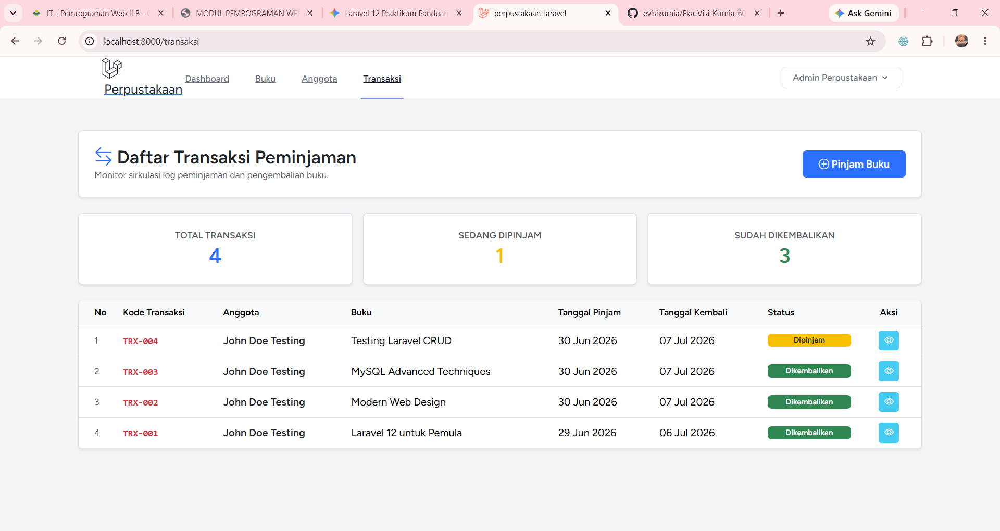
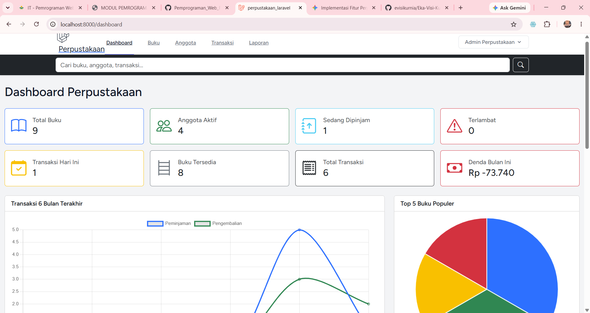
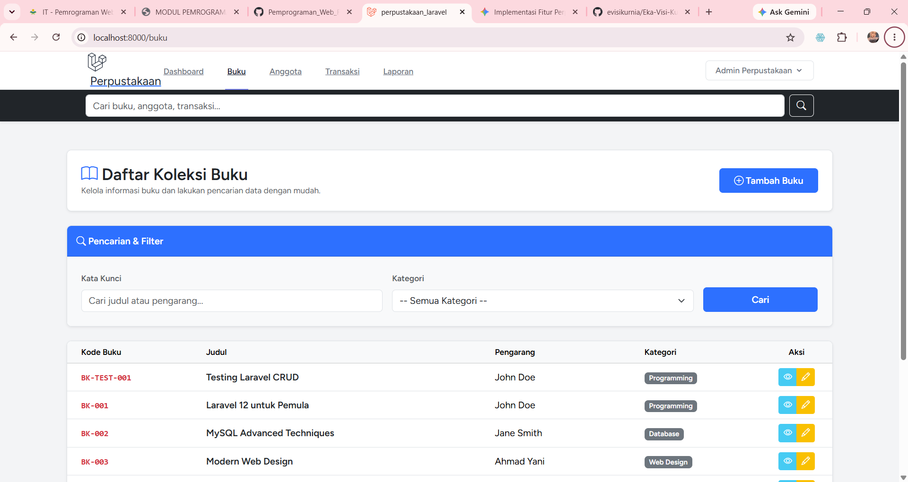
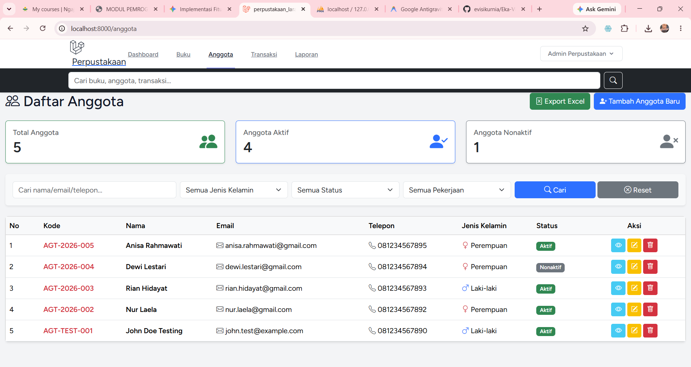
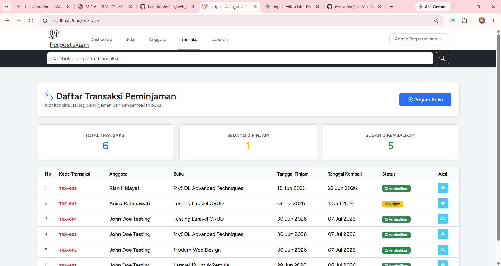
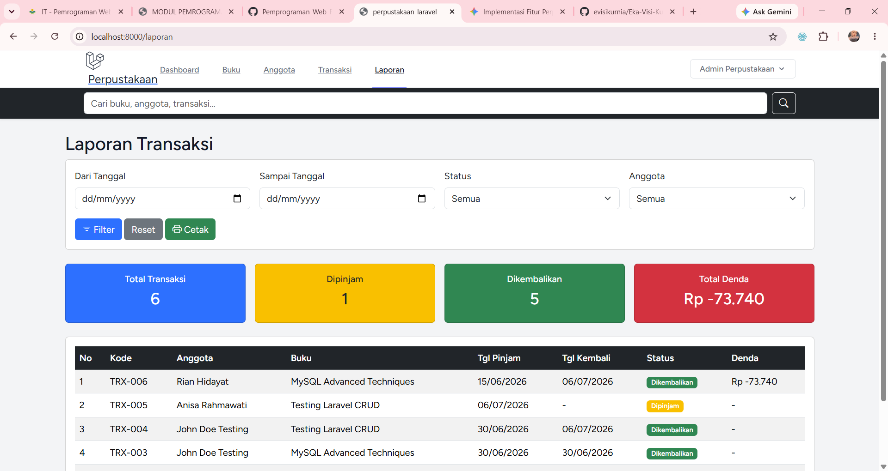

# Sistem Manajemen Perpustakaan (Perpustakaan Digital)
 **Nama:** Eka Visi Kurnia
 **NIM:** 60324074
 **Kelas:** Pemrograman Web 2 - B

Sistem Manajemen Perpustakaan modern berbasis web yang dibangun menggunakan *Laravel 13* dengan fitur lengkap untuk mengelola buku, anggota, transaksi peminjaman, dan laporan.

---

## 💻 Tech Stack & Kebutuhan Sistem

* **Backend:** Laravel Framework (PHP >= 8.2)
*   **Database:** MySQL / MariaDB
*   **Frontend:** Bootstrap 5 / Tailwind CSS, Blade Templating Engine
*   **Library Tambahan:** `maatwebsite/excel` (Untuk Export Excel)

---

## Arsitektur Folder Views

```text
resources/views/
├── anggota/
│   ├── create.blade.php
│   ├── edit.blade.php
│   ├── index.blade.php
│   └── show.blade.php
├── buku/
│   ├── create.blade.php
│   ├── edit.blade.php
│   ├── index.blade.php
│   └── show.blade.php
├── transaksi/
│   ├── cetak_laporan.blade.php  <-- Layout khusus cetak PDF / window.print
│   ├── create.blade.php         <-- Form tambah transaksi peminjaman
│   ├── index.blade.php          <-- Daftar sirkulasi + Badge Terlambat
│   ├── laporan.blade.php        <-- Filter laporan periodik & akumulasi denda
│   └── show.blade.php           <-- Detail transaksi & tombol hitung denda
└── layouts/
    ├── app.blade.php
    ├── navigation.blade.php     <-- Navigasi link terintegrasi auth
    └── footer.blade.php
```
---

## Cara Menjalankan Proyek Lokal

1. Clone repository ini atau download zip.
2. Pastikan XAMPP (Apache & MySQL) sudah aktif.
3. Jalankan perintah instalasi dependensi PHP:
   ```bash
   composer install
   ```
4. Salin berkas .env.example menjadi .env, lalu sesuaikan konfigurasi database Anda.
5. Jalankan migrasi database terbaru untuk memperbarui skema tabel transaksi:
   ```bash
   php artisan migrate --seed
   ```
6. Kompilasi ulang aset frontend (jika diperlukan):
   ```bash
   npm install && npm run dev
   ```
7. Jalankan server lokal:
   ```bash
   php artisan serve
   ```
   Akses aplikasi melalui browser di: http://localhost:8000
   Bukti server berjalan
   

---

## Dokumentasi Tampilan Aplikasi
### 1. Halaman Login Sistem (Laravel Breeze)
Gerbang utama autentikasi admin perpustakaan sebelum dapat mengakses data sirkulasi.


###  2. Dashboard
Menampilkan ringkasan data statistik perpustakaan serta grafik visualisasi data sirkulasi.


### 3. Manajemen Data Buku
Halaman pengelolaan data master buku perpustakaan secara lengkap dilengkapi fitur filter kategori.


### 4. Manajemen Data Anggota
Halaman manajemen data master anggota perpustakaan dilengkapi dengan sistem validasi format terintegrasi.


### 5. Transaksi Peminjaman Buku
Form sirkulasi peminjaman buku pintar dengan validasi stok otomatis dan kalkulasi tenggat kembali.


### 6. Laporan Transaksi
Menu rekapitulasi data sirkulasi dengan fitur akumulasi denda real-time dan fungsi cetak ramah printer.


### 7. Global Search & Filter
Sistem pencarian global dan penyaringan data dinamis di seluruh modul utama aplikasi.

